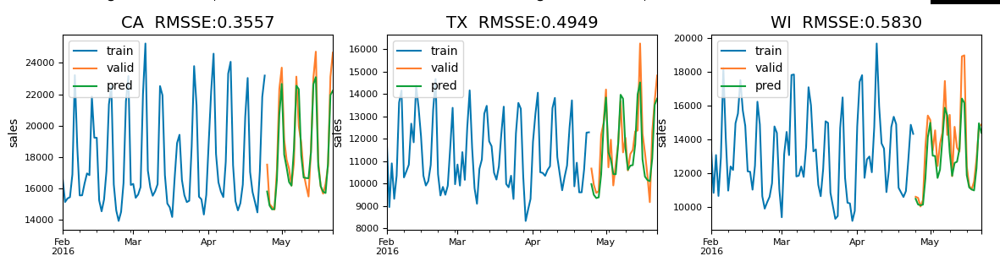

# Kaggle M5 Solutions

## Competition Overview

- M5 Competition is a competition of time series prediction
- Predict unit sales of Walmart

## Feature Engineering

### Categorical features

- item_id
- dept_id
- cat_id
- state_id
- store_id

### Price features

- basic price features (max, min, mean)
- unique count
- momentum
- discount

### Calendar features

- week
- month
- dayofweek
- weekend
- quarter
- week of month
- payday
- event
- snap
- event strength ([My solution](https://github.com/kiccho1101/kaggle_m5_forecasting))

### Lag features

- Lag features (7\~14, 28\~42, 365)
- Average lag (lag7 + lag14 + lag21 + lag28 + lag35) ([111th](https://www.kaggle.com/c/m5-forecasting-accuracy/discussion/164315))
- rolling mean, std (lag=[7, 30, 60, 90], window_size=[7, 30, 60, 90, 180])
- grouped rolling mean, std ([My solution](https://github.com/kiccho1101/kaggle_m5_forecasting))

### Target encoding features

- item_id
- item_id, dept_id
- item_id, cat_id
- item_id, store_id
- item_id, state_id,
- item_id, store_id
- item_id, store_id, snap
- item_id, store_id, event
- item_id, store_id, dayofweek
- item_id, store_id, week
- item_id, store_id, month
- etc...

- catch22 features ([My solution](https://github.com/kiccho1101/kaggle_m5_forecasting))

### External features

- weather
- unemployment rate
- stock price
- CPI
- Natural disaster

## Models

- LightGBM ([1st](https://www.kaggle.com/c/m5-forecasting-accuracy/discussion/163684), [2nd](https://www.kaggle.com/c/m5-forecasting-accuracy/discussion/164599), [3rd](https://www.kaggle.com/c/m5-forecasting-accuracy/discussion/163216), [5th](https://www.kaggle.com/c/m5-forecasting-accuracy/discussion/163916), [21st](https://www.kaggle.com/c/m5-forecasting-accuracy/discussion/164685), [25th](https://www.kaggle.com/c/m5-forecasting-accuracy/discussion/163564), [111th](https://www.kaggle.com/c/m5-forecasting-accuracy/discussion/164315), [211th](https://www.kaggle.com/c/m5-forecasting-accuracy/discussion/163206))

- XGBoost ([211th](https://www.kaggle.com/c/m5-forecasting-accuracy/discussion/163206))

- Catboost ([211th](https://www.kaggle.com/c/m5-forecasting-accuracy/discussion/163206))

- Prophet ([211th](https://www.kaggle.com/c/m5-forecasting-accuracy/discussion/163206))

- DeepAR ([3rd](https://www.kaggle.com/c/m5-forecasting-accuracy/discussion/164374))

- NN ([21st](https://www.kaggle.com/c/m5-forecasting-accuracy/discussion/164685))

## CV

- d1578-d1605 (1 year before private LB)
- d1830-1857
- d1858-d1885
- d1886-d1913
- d1914-d1941 (Public LB)

## Others

- [Shake Up Explained](https://www.kaggle.com/c/m5-forecasting-accuracy/discussion/163621)

- [Magic Multiplier](https://www.kaggle.com/c/m5-forecasting-accuracy/discussion/163047)

- [Magic Multiplier by each store](https://www.kaggle.com/c/m5-forecasting-accuracy/discussion/163916)

- [Emsambling day-by-day and recursive models]()